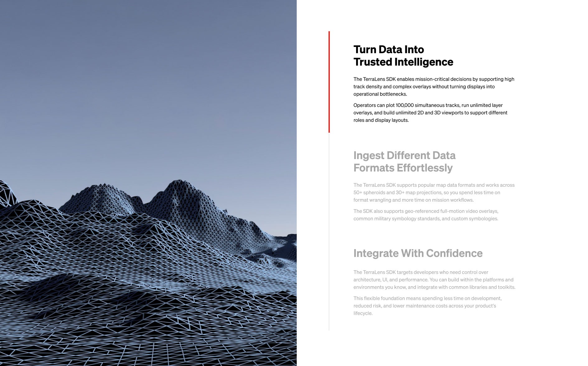

# Scrolling Text with Image

A two-column block: a column of text sections on the right and one image per section on the left.

On desktop, once the block reaches the top of the screen the page stops, the text scrolls inside the block, the active section is highlighted with a red bar, and the left image changes with it. After the last section the page scrolls on normally. On tablet and mobile (1024px and below) it becomes a simple stacked layout.



## Installation

Follow the steps in the [main README](../../README.md#installation). Block name: `scrolling-text-with-image`.

## Fields

| Field name | Type | Notes |
| --- | --- | --- |
| `title_tag` | Select | Heading tag for the titles (`h2`, `h3`, ...) |
| `title_fontsize` | Select | Choices are filled in by the shared render file |
| `background_image` | Image | Optional section background |
| `content_boxes` | Repeater | One row per text section |
| `content_boxes → title` | Text | Use `\|` for a line break |
| `content_boxes → content` | WYSIWYG | Section text |
| `content_boxes → side_image` | Image | Left image for this section. If a row has no image, the previous image stays visible |

The block also supports the standard block settings: alignment (wide and full), anchor, additional CSS class, text and background colour, and font size.

## What your theme needs to provide

- **CSS variables:** `--wp--preset--color--red` (active bar) and `--wp--preset--color--lightbeige` (inactive bar). Define them in `theme.json` or in your own CSS.
- **Font size classes** such as `fontsize-large-50` and `fontsize-small-16`, matching the choices of `title_fontsize`.
- **Optional utility classes:** `animated`, `fadeInUp`, `fadeInLeft`, `delay-100ms` and the `bgcolor-*` / `textcolor-*` classes. Skip them if you don't use them.
- **No jQuery** and no animation libraries. The block JavaScript is plain vanilla JS.

## Settings you can change

**CSS** (top of `css/block_scrolling-text-with-image.css`):

```css
.section_scroll_text_box {
	--pin-h: 700px;   /* height of the block on desktop */
	--pin-top: 0px;   /* height of a fixed header, in px, so the block sits under it */
}
```

**JavaScript** (top of `js/blocks_js/block_scrolling-text-with-image.js`):

| Constant | Default | What it does |
| --- | --- | --- |
| `TRIGGER_RATIO` | `0.3` | How far from the top of the box a section becomes active (30%) |
| `END_SPACE` | `50` | Empty space in px under the last section |
| `HOLD_MS` | `250` | Short pause at the first or last section so trackpad momentum doesn't push the page |

## Behaviour notes

- **Scroll lock is desktop only.** It is active above 1024px with a mouse or trackpad. On touch screens the text column scrolls with a normal swipe, and below 1024px the layout is stacked.
- **Keyboard:** while the block is locked, Arrow keys, Space and Page Up/Down move through the sections, so keyboard users can get past the block. Home and End release the lock.
- **Editor:** the scroll lock is disabled inside the block editor, and the text column scrolls normally there.
- **Scrollbar:** the CSS adds `scrollbar-gutter: stable` to `html` on pages that contain the block, so the layout doesn't shift when the scrollbar disappears during the lock.

## Troubleshooting

- **Page doesn't stop at the block:** open the browser console and check for JavaScript errors. Also check that no other script is blocking wheel events on the page.
- **Block hides under a fixed header:** set `--pin-top` to the header height.
